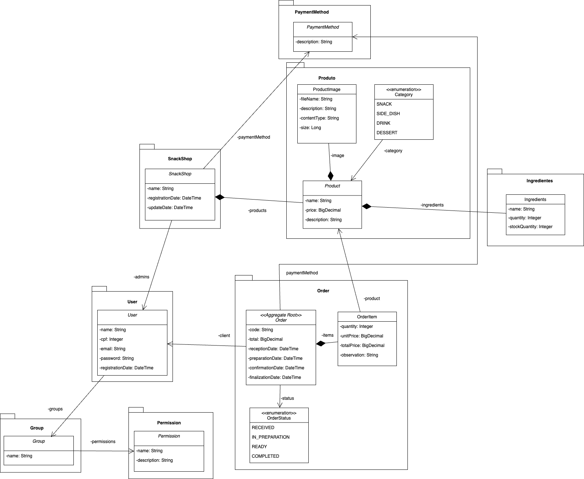
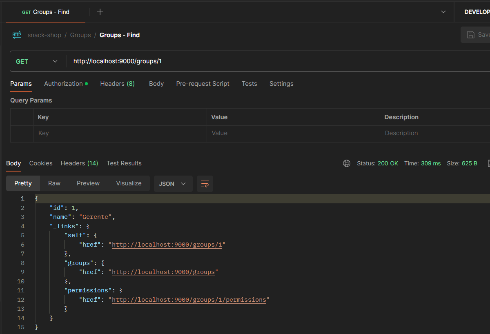
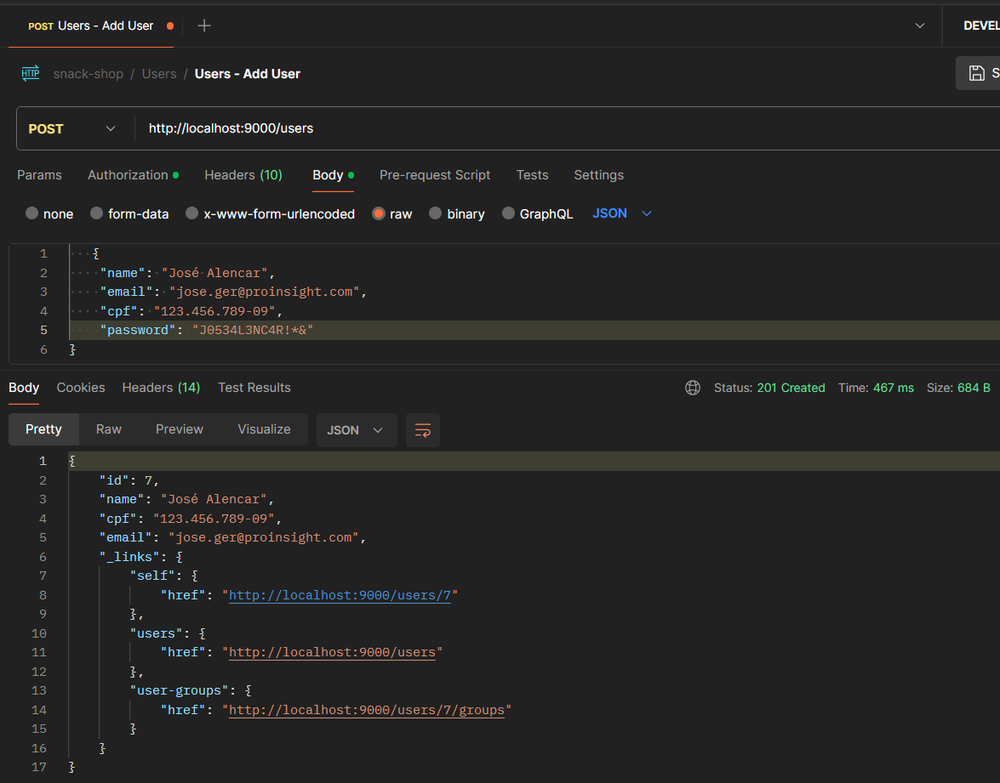
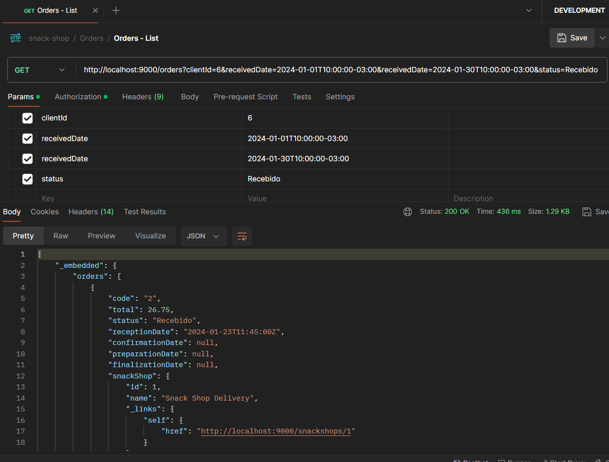
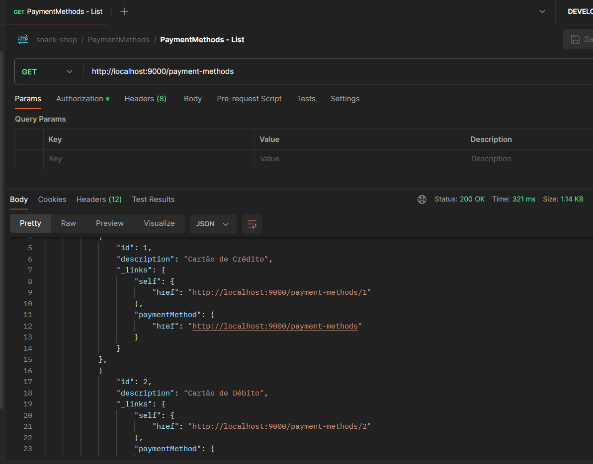
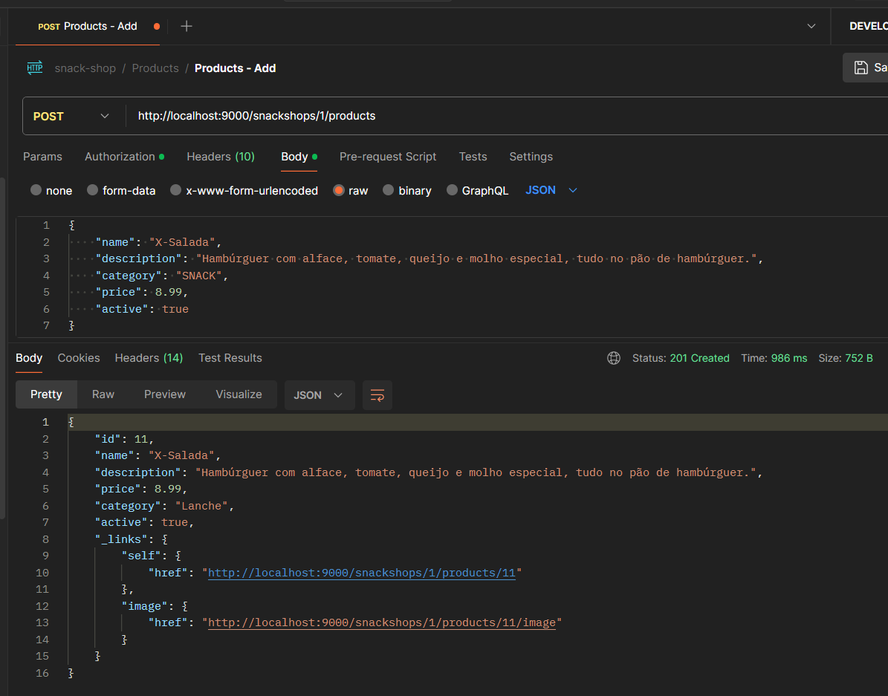
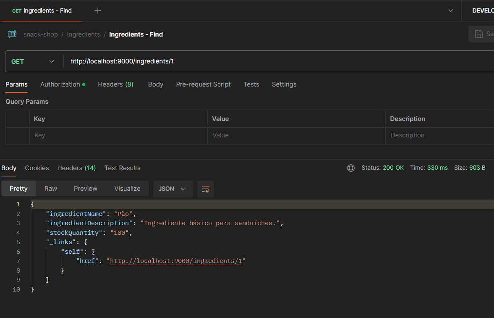

# Snack Shop API


## 📝 Descrição

O Snack Shop API é um sistema de gerenciamento para lanchonetes que oferece uma série de vantagens. Ele permite a realização de pedidos de forma eficiente e intuitiva, melhorando a experiência do cliente e otimizando o tempo dos funcionários.

Com a Snack Shop API, é possível cadastrar produtos, usuários e ingredientes, permitindo um controle preciso do inventário e facilitando a gestão de recursos. Além disso, o sistema permite atribuir diferentes permissões a usuários, garantindo que cada membro da equipe tenha acesso apenas às informações e funcionalidades que precisa para realizar seu trabalho.

A API é construída com tecnologias robustas e modernas, garantindo a segurança e a escalabilidade necessárias para o crescimento do seu negócio.

Em resumo, a Snack Shop API é uma solução completa para lanchonetes que buscam melhorar sua eficiência operacional e proporcionar uma experiência superior aos seus clientes.

## 📄 Diagramas de negócio
- [Processos](https://miro.com/app/board/uXjVNzyqNFE=/)
- Diagrama de Objetos
  

## 💻 Tecnologias

As seguintes ferramentas foram usadas na construção do projeto:

- [Java](https://www.java.com)
- [Spring Boot](https://spring.io/projects/spring-boot)
- [Maven](https://maven.apache.org/)
- [SQL](https://www.mysql.com/)
## ✅ Pré-requisitos

Antes de começar, você vai precisar ter instalado em sua máquina as seguintes ferramentas:
- [Docker](https://www.docker.com/products/docker-desktop)
- [Docker Compose](https://docs.docker.com/compose/install/)

## 🚀 Como executar o projeto

### ⚙️ Rodando o Backend (servidor)

```bash
# Clone este repositório
$ git clone https://github.com/proinsighttech/snack-shop-delivery.git

# Acesse a pasta do projeto no terminal/cmd
$ cd snack-shop-delivery

# Use o Docker Compose para subir a aplicação e o banco de dados
$ docker-compose up
```

Ao executar o comando docker-compose up, o Docker Compose inicia a aplicação e o banco de dados em contêineres separados, mas na mesma rede Docker. Isso permite que a aplicação e o banco de dados se comuniquem entre si.  O banco de dados é iniciado na porta padrão 3306. 

A aplicação Spring Boot, por sua vez, se conecta a este banco de dados através da rede Docker.  Quando a aplicação Spring Boot é iniciada, o Flyway é executado. O Flyway é uma ferramenta de migração de banco de dados que ajuda a gerenciar e aplicar mudanças no esquema do banco de dados. Ele cria as tabelas necessárias para a interação com a aplicação, como as tabelas de pedidos, usuários, produtos e ingredientes.  

Após a criação das tabelas, um script chamado afterMigrate.sql é executado. Este script preenche as tabelas com dados fictícios, permitindo que você teste a aplicação.  Finalmente, a aplicação é exposta na porta 9000. Você pode interagir com a aplicação através de um cliente HTTP como o Postman, chamando os respectivos endpoints da API.


## 📝 Documentação da API

Para testar a aplicação, fornecemos uma coleção do Postman que contém várias solicitações pré-configuradas. Esta coleção está localizada no diretório src/main/resources/collections do projeto.  Para importar a coleção no Postman, siga os passos abaixo:  

1. Abra o Postman.
2. Clique no botão "Import" no canto superior esquerdo.
3. Na janela que se abre, selecione a opção "File".
4. Navegue até o diretório src/main/resources/collections do projeto e selecione o arquivo da coleção.
5. Clique em "Open" para importar a coleção.

Após importar a coleção, você verá uma lista de solicitações no painel esquerdo do Postman. Você pode clicar em qualquer uma dessas solicitações para abri-la e, em seguida, clicar no botão "Send" para enviar a solicitação para a aplicação.  Lembre-se de que a aplicação deve estar rodando na porta 9000 para que você possa interagir com ela através do Postman.

### 👥 Grupos

Para listar os grupos cadastrados na aplicação definimos uma pasta dentro da Collection chamada de Groups, nela você encontrará as seguintes requisições:

- Listar todos os grupos
- Listar grupo por ID
- Adicionar Grupo
- Atualizar Grupo
- Remover Grupo
- Listar Permissões do Grupo
- Adicionar Permissão ao Grupo
- Remover Permissão do Grupo


### Exemplo de Requisição
- Buscando Grupo por ID


### 👤 Usuários

Para listar os usuários cadastrados na aplicação definimos uma pasta dentro da Collection chamada de Users, nela você encontrará as seguintes requisições:

- Listar todos os usuários
- Listar usuário por ID
- Listar Grupo de Usuários
- Adicionar Usuário ao Grupo
- Remover Usuário do Grupo
- Adicionar Usuário
- Atualizar Usuário
- Remover Usuário
- Alterar Senha do Usuário

### Exemplo de Requisição
- Adicionando Usuário



### 🛒 Pedidos

Para listar os pedidos cadastrados na aplicação definimos uma pasta dentro da Collection chamada de Orders, nela você encontrará as seguintes requisições:

- Listar todos os pedidos
- Listar pedido por ID
- Adicionar Pedido
- Atualizar Status do Pedidos

### Exemplo de Requisição
- Listando Pedidos
Ao listar os pedidos podemos filtar por status, intervalo de data de criação e usuário.



### 💳 Métodos de Pagamento

Para listar os metodos de pagamento cadastrados na aplicação definimos uma pasta dentro da Collection chamada de Payment Methods, nela você encontrará as seguintes requisições:

- Listar todos os metodos de pagamento
- Listar metodo de pagamento por ID
- Adicionar Metodo de Pagamento
- Atualizar Metodo de Pagamento
- Remover Metodo de Pagamento

### Exemplo de Requisição
- Listando Metodos de Pagamento


### 🍔 Lanchonetes

Para listar as lanchonetes cadastradas na aplicação definimos uma pasta dentro da Collection chamada de Snack Bars, nela você encontrará as seguintes requisições:

- Listar todas as lanchonetes
- Listar lanchonete por ID
- Adicionar Lanchonete
- Atualizar Lanchonete
- Ativar/Desativar Lanchonete
- Lista de Produtos da Lanchonete
- Lista Formas de Pagamento da Lanchonete
- Adicionar Forma de Pagamento a Lanchonete
- Remover Forma de Pagamento da Lanchonete
- Lista Administradores da Lanchonete
- Adicionar Administrador a Lanchonete
- Remover Administrador da Lanchonete

### Exemplo de Requisição
- Listando Lanchonetes


### 📦 Produtos

Para listar os produtos cadastrados na aplicação definimos uma pasta dentro da Collection chamada de Products, nela você encontrará as seguintes requisições:

- Listar todos os produtos
- Listar produto por ID
- Adicionar Produto
- Atualizar Produto
- Remover Produto

### Exemplo de Requisição
- Adicionando Produto



### 🥕 Ingredientes

Para listar os ingredientes cadastrados na aplicação definimos uma pasta dentro da Collection chamada de Ingredients, nela você encontrará as seguintes requisições:

- Listar todos os ingredientes
- Listar ingrediente por ID
- Adicionar Ingrediente
- Atualizar Ingrediente
- Remover Ingrediente
- Lista Ingredientes em Estoque


### Exemplo de Requisição
- Listando Ingrediente em Estoque


